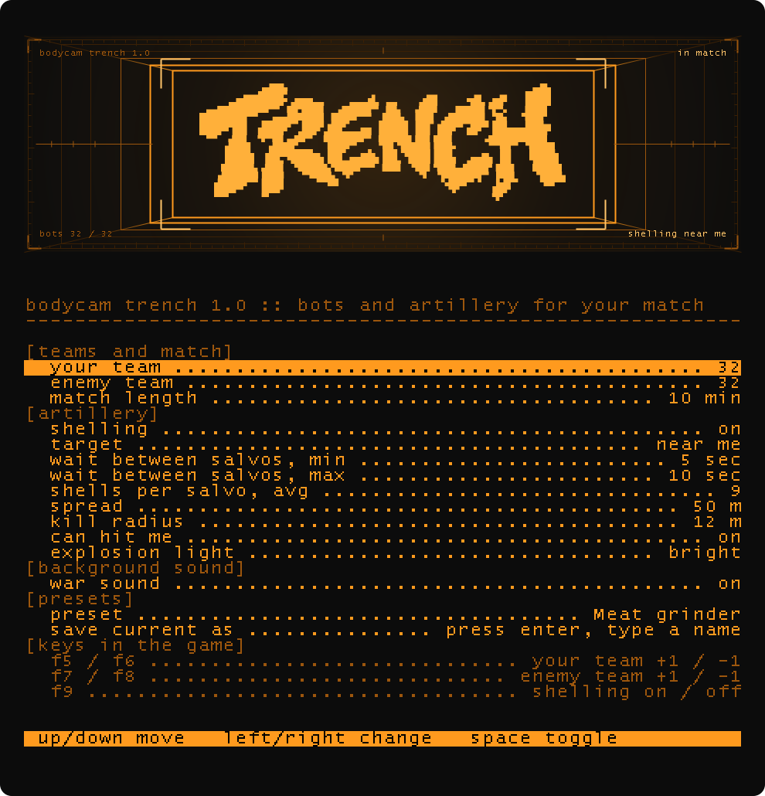
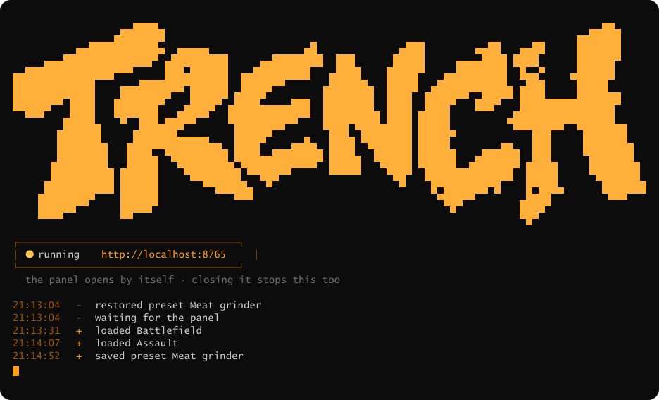

# TRENCH

**Bots and artillery for a Bodycam match you host.**

[**Download on Nexus**](https://www.nexusmods.com/bodycam/mods/50) · [**Download here**](https://github.com/0x0d4ddy/TRENCH/releases/latest) · [**Watch it**](https://www.youtube.com/watch?v=iaDhKQUKufY)

Bodycam is multiplayer only, and a lobby that does not fill is not a battle. TRENCH fills both
teams with as many bots as you ask for and keeps them at that number for the whole match, then
shells the ground they fight over.

## What it does

This mod lets you add more than 10 bots to the game, as many as your PC can handle. It also lets you choose the match length, and adds artillery strikes with a ton of settings so you can tweak them however you like.

## Requirements

- Bodycam on Steam
- [UE4SS](https://github.com/UE4SS-RE/RE-UE4SS/releases) — install it first, TRENCH is a UE4SS Lua mod
- [Node.js](https://nodejs.org) (LTS) — runs the TRENCH panel and the shell sounds

## Install

1. Download the [latest release](https://github.com/0x0d4ddy/TRENCH/releases/latest) and unpack it.
2. In Steam: right-click Bodycam > **Manage** > **Browse local files**, then open
   `Bodycam\Binaries\Win64\ue4ss\Mods`.
3. Copy the `TRENCH` folder from the archive into that Mods folder, so you end up with
   `...\ue4ss\Mods\TRENCH\Scripts\main.lua`.
4. Open `ue4ss\Mods\mods.txt` in Notepad and add the line `TRENCH : 1` (anywhere above the
   Keybinds line).

Updating from an older copy: keep your `Mods\TRENCH\presets` folder and `settings.ini`, copy the
new files over the rest. To remove it: delete `Mods\TRENCH` and the TRENCH line in `mods.txt`.

## Launch

Just start Bodycam from Steam. The TRENCH panel opens by itself as the game loads, with a
minimised TRENCH console window on the taskbar next to it. **Leave both open while you play** —
closing either one stops the panel and the shell sounds.

Closed the panel by accident? Restart the game, or open the `Mods\TRENCH\editor` folder, type
`cmd /k node server.js` in the address bar and press Enter.

No panel at all? Node.js is not installed. `TRENCH.log` in the mod folder says `Panel: started`
or why it was not.

## Using it

Host a Team Deathmatch match.

In the panel: up/down to move, left/right to change, space to toggle. On the preset line,
left/right steps through your presets and applies them as you go; Delete twice removes one.

In the game, without leaving it:

| key | |
|---|---|
| `F5` / `F6` | your team, one more / one less |
| `F7` / `F8` | the enemy team, one more / one less |
| `F9` | shelling on / off |

Four presets come with it, from quiet to unsurvivable:

| | teams | salvo every | shells | spread | kill | target |
|---|---|---|---|---|---|---|
| **Calm** | 8 v 8 | — | — | — | — | no shelling |
| **Battlefield** | 12 v 12 | 12–25 s | 5 | 30 m | 7 m | whole map, never you |
| **Assault** | 20 v 20 | 8–15 s | 6 | 40 m | 9 m | the fighting |
| **Meat grinder** | 32 v 32 | 5–10 s | 9 | 50 m | 12 m | you |

## The console

The panel runs a small local server. It talks to nothing but the mod, over a port on your own
machine.

## Notes

The map is built for ten players. Asking for sixty gives you sixty, but they share the same
spawn points and crowd each other; TRENCH steps a bot clear when it lands on top of someone,
and that is as far as it goes. Somewhere around 12–20 a side still looks like a battle.

Bot marksmanship and behaviour are not reachable from a Lua mod — they live inside Blueprint
bytecode. If you want smarter bots, there are `.pak` mods for that, and they work alongside
this one.

## Credits

TRENCH grew out of
[BODYCAM-Game — Increase maximum limit of players](https://github.com/TRUEMODELOFTHEWORLD/BODYCAM-Game---Increase-maximum-limit-of-players)
by **TRUEMODELOFTHEWORLD**, under the MIT License. That mod worked out the first hard part —
getting a host to accept more players than the game allows, and doing it through reflection
without touching a single game file. Thank you.

See [THIRD-PARTY.md](THIRD-PARTY.md) for the licences of everything that came from elsewhere.

## Licence

MIT — see [LICENSE](LICENSE).
